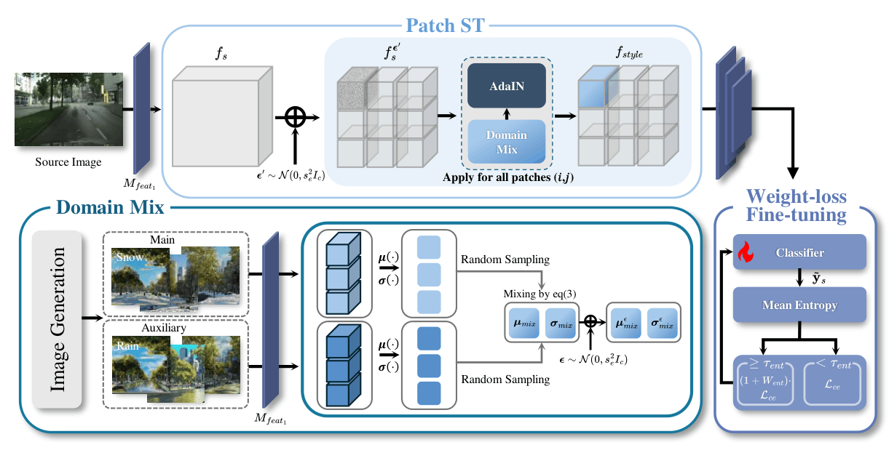

# SIDA: Synthetic Image Driven Zero-shot Domain Adaptation

[Ye-Chan Kim](#), [SeungJu Cha](#), [Si-Woo Kim](#), [Taewhan Kim](#), [Dong-Jin Kim](#)†

Hanyang University

**ACM MM 2025** · [Paper (arXiv)](https://arxiv.org/abs/2507.18632) · [ACM DL](https://dl.acm.org/doi/10.1145/3746027.3754715)

---

<p align="center">
  
  <br>
</p>

> **TL;DR.** SIDA is a zero-shot domain adaptation method that replaces text-based target descriptions with **synthetic images**. We first generate detailed, source-like images, then translate them to the target style, and use their feature statistics as a proxy for the target domain. Two modules — **Domain Mix** (blending multiple synthetic styles) and **Patch Style Transfer** (per-patch style assignment) — model fine-grained intra-domain variation, achieving SOTA performance on challenging zero-shot adaptation scenarios while significantly reducing adaptation time.

## Table of Contents
- [Installation](#installation)
- [Datasets](#datasets)
- [Source Models](#source-models)
- [Synthetic Image Statistics (PIN)](#synthetic-image-statistics-pin)
- [Running SIDA](#running-sida)
- [Evaluation](#evaluation)
- [Main Results](#main-results)
- [Citation](#citation)
- [Acknowledgement](#acknowledgement)
- [License](#license)

## Installation

Create a conda environment from the provided file:

```bash
conda env create --file environment.yml
conda activate sida
```

## Datasets

* **Cityscapes**: Download images and semantic segmentation ground truths from the [Cityscapes website](https://www.cityscapes-dataset.com/). Expected structure:
  ```
  <CITYSCAPES_DIR>/
  ├── leftImg8bit/    # input images (leftImg8bit_trainvaltest.zip)
  └── gtFine/         # labels (gtFine_trainvaltest.zip)
  ```

* **ACDC**: Download from [ACDC](https://acdc.vision.ee.ethz.ch/download). Expected structure:
  ```
  <ACDC_DIR>/
  ├── rgb_anon/       # input images (rgb_anon_trainvaltest.zip)
  └── gt/             # labels (gt_trainval.zip)
  ```

* **GTA5** (optional): Download from [GTA5](https://download.visinf.tu-darmstadt.de/data/from_games/). Expected structure:
  ```
  <GTA5_DIR>/
  ├── images/
  └── labels/
  ```

* **Sand / Fire (challenging domains)**: Follow the [ULDA Sand-Fire dataset](https://huggingface.co/datasets/Senqiao/Sand-Fire-ULDA) instructions. Each dataset should follow:
  ```
  <FIRE_DIR>/
  ├── imgs/
  └── visualize/
  ```

## Source Models

The Cityscapes source model used in our experiments is the one released by PODA, available [here](https://drive.google.com/drive/folders/15-NhVItiVbplg_If3HJibokJssu1NoxL?usp=sharing).

## Synthetic Image Statistics

SIDA uses per-target-domain feature statistics computed from synthetic, style-translated images. We provide the precomputed statistics under [`synthesis_value/`](./synthesis_value):

```
synthesis_value/
├── translation_night.pkl
├── translation_snow.pkl
├── translation_rain.pkl
└── translation_fog.pkl
```


## Running SIDA

Adapt the source model with SIDA (Domain Mix + Patch Style Transfer):

```bash
python3 main.py \
  --dataset cityscapes \
  --data_root <CITYSCAPES_DIR> \
  --ckpt <PATH_TO_SOURCE_CKPT> \
  --val_data_root <ACDC_DIR> \
  --pin_stats_dir ./synthesis_value \
  --batch_size 8 \
  --lr 0.01 \
  --total_itrs 2000 \
  --val_interval 100 \
  --freeze_BB \
  --train_aug \
  --SIDA \
  --domain_mix \
  --ACDC_sub night \
  --sub_domain night \
  --ckpts_path adapted 
```


### Evaluation

```bash
python3 main.py \
  --dataset <ACDC|cityscapes|gta5|fire|sand> \
  --data_root <DATASET_DIR> \
  --ckpt <PATH_TO_ADAPTED_CKPT> \
  --ACDC_sub <night|snow|rain|fog> \
  --test_only \
  --val_batch_size 1
```

## Main Results

**Cityscapes → ACDC** (mIoU %, mean ± std over seeds):

| Method | Night | Snow | Rain | Fog |
|---|---|---|---|---|
| **SIDA (ours)** | **25.73 ± 0.21** | **46.48 ± 0.59** | **46.45 ± 0.21** | **53.84 ± 0.43** |

**Cityscapes → Challenging Domains** (mIoU %):

| Method | Fire | Sandstorm |
|---|---|---|
| **SIDA (ours)** | **28.02** | **22.14** |


## Citation

If you find SIDA useful, please cite:

```bibtex
@inproceedings{kim2025sida,
  title     = {SIDA: Synthetic Image Driven Zero-shot Domain Adaptation},
  author    = {Kim, Ye-Chan and Cha, SeungJu and Kim, Si-Woo and Kim, Taewhan and Kim, Dong-Jin},
  booktitle = {Proceedings of the 33rd ACM International Conference on Multimedia (ACM MM)},
  year      = {2025},
  doi       = {10.1145/3746027.3754715}
}
```

## Acknowledgement

This codebase is built on top of [PODA](https://github.com/astra-vision/PODA) (Fahes et al., ICCV 2023) and borrows from [DeepLabV3Plus-Pytorch](https://github.com/VainF/DeepLabV3Plus-Pytorch) and [CLIP](https://github.com/openai/CLIP). We also thank the authors of [ULDA](https://github.com/Yangsenqiao/ULDA/) (Yang et al., CVPR 2024) for releasing the Sand-Fire benchmark. We thank all the authors for their open-source contributions.

## License

SIDA is released under the [Apache 2.0 License](./LICENSE).
